<h1>Anotações sobre o livro <strong>"Entendo Algoritmos"</strong> de Aditya Y. Bhargava</h1>

<https://github.com/egonSchiele/grokking_algorithms>


<h2>

Capítulos

 - [1 - Introdução a algoritmos](#1---introdução-a-algoritmos)
 - [2 - Ordenação por seleção](#2---ordenação-por-seleção)
 - [3 - Recursão](#3---recursão)
 - [4 - Quicksort](#4---quicksort)
 - [5 - Tabelas hash](#5---tabelas-hash)
 - [6 - Pesquisa em largura](#6---pesquisa-em-largura)

</h2>

## 1 - Introdução a algoritmos

- Introdução
  - Um algoritmo é um conjunto de instruções que realizam uma tarefa

- Pesquisa Binária
  - É um algoritmo que resolve o problema de busca. Sua entrada é uma lista ordenada de elementos. Se o elemento buscado está na lista, a pesquisa binária retorna a sua localização. Senão, retorna None.
  - Com a pesquisa binária, você chuta um número intermadiário e elimina a metade dos números restantes a cada vez.
  - Para uma lista de n elementos, a pesquisa bínaria precisa de log2(n) (log de n na base 2) etapas para retornar o valor correto, enquanto que a pesquisa simples (ou linear) precisa de n etapas.
  - A pesquisa binária só funciona quando a *lista está ordenada*
  - A pesquisa binária é executada com tempo logarítmico
  - Lógica da busca binária:
    1. Ache o elemento central
    2. O elemento cetral é o elemento procurado? Se sim, retorna o index dele
    3. Se o elemento central é menor do que o procurado, então elimine todos os itens menores do que o elemento central
    4. Se o elemento central é maior do que o procurado, então elimine todos os itens maiores do que o elemento central
    5. Repetir os passos anteriores até encontrar
    6. Se o elemento não é encontrado, então retorne None
  - [Algoritmo da busca binária](algorithms/binary_search.py):

    ```python
    # Binary Search
    def binary_search(array, item):
        low = 0
        high = len(array) - 1

        while low <= high:
            half = (low + high) // 2
            guess = array[half]

            if guess == item:
                return half
            elif guess <= item:
                low = half + 1
            else:
                high = half - 1

        return None
    ```

- Notação Big O
  - É uma notação especial que diz o quão rápido é um algoritmo
  - Tempo de execução dos algoritmos cresce a taxas diferentes
  - Não basta saber quanto tempo um algoritmo leva para ser executado, pois isso depende de fatores externos como processador, linguagem, memória etc.
  - É mais importante saber se o tempo de execução aumenta conforme o tamanho da entrada aumenta
  - A notação Big O informa quão rápido é um algoritmo, quão rapidamente ele cresce
  - A notação não fornece o tempo em segundos
  - Ela permite que você compare o número de operações
  - Por exemplo, a busca binária precisa de log n operações pra verificar uma lista de tamanho n. Logo, a notação Big O para o binary search é O(log n)
  - ***De maneira geral, a notação big O pode ser escrita como O(f(n)), onde f(n) é uma função que fornece o número de operações que um algoritmo realiza dado o tamanho da entrada***
  - ***A notação Big O conta o número de operações***
  - A notação big O nos dá a taxa de crescimento do tempo de execução (número de operações) em função do tamanho da entrada
  - A notação Big O leva em conta a pior das hipóteses para contar o número de operações
  - Além do tempo de execução para o pior caso, é importante analisar o tempo de execução para o caso médio. Isso é tratado em [4 - Quicksort](#4---quicksort)
  - Alguns exemplos comuns de tempo de execução Big O (ordenado do mais rápido para o mais lento)
    - O(log n), tempo logarítmico. Exemplo: pesquisa binária
    - O(n), tempo linear. Exemplo: pesquisa simples (ou linear)
    - O(n * log n). Exemplo: quicksort
    - O(n²). Exemplo: selection sort
    - O(n!). Exemplo: caixeiro-viajante
  - ***Principais pontos***:
    - ***A rapidez de um algoritmo não é medida em segundos, mas pelo crescimento do número de operações***
    - Discutimos sobre o quão rapidamente o tempo de execução de um algoritmo aumenta conforme o número de elementos (tamanho do input) aumenta
    - O tempo de execução em algoritmos é expresso na notação Big O
    - O(log n) é mais rápido do que O(n), e O(log n) fica ainda mais rápido conforme a lista aumenta

## 2 - Ordenação por seleção

- Como funciona a memória
  - O computador se parece com um grande conjunto de gavetas, e cada gaveta tem seu endereço. O conjunto de gavetas é chamado de memória. Podemos armazenar coisas nas gavetas. Cada 'gaveta' é um slot/espaço na memória
  - Cada vez que queremos armazenar um item na memória, pedimos ao computador um pouco de espaço e ele nos dá um endereço no qual podemos armazenar o item que queremos
  - ***Se quisermos armazenar múltiplos itens, existem duas maneiras para fazer isso: arrays e listas encadeadas***

- Arrays e listas encadeadas
  - Arrays armazenam itens contiguamente (um do lado do outro) na memória
  - Se você quiser adicionar um novo item ao array, você precisa solicitar ao computador uma área de memória que caiba todos os itens contiguamente
  - Adicionar novos itens a um array é lento
  - Um jeito de contornar o problema de adição de itens a um array é 'reservar lugares', mesmo que não utilize todos. Porém, isso traz desvantagens:
    - Você pode não precisar dos espaços extras reservados, então a memória será desperdiçada. Vocẽ nao está utilizando memória, mas ninguém pode usá-la também
    - Você pode precisar adicionar mais itens (além do número de espaços reservados), então você terá de mover todos os itens para um novo espaço de memória que caiba todos
  - Listas encadeadas resolvem o problema da adição de itens

- Listas encadeadas
  - Com listas encadeadas, seus itens podem estar em qualquer lugar da memória. Cada item armazena o endereço do próximo item da lista, endereços aleatórios de memória ficam ligados
  - Adicionar um item a uma lista encadeada é fácil: você o coloca em qualquer lugar da memória e armazena o endereço no item anterior
  - Com listas encadeadas, nunca precisamos mover seus itens
  - Listas encadeadas são muito melhores do que arrays para inserções de novos itens
  - Só podem lidar com acesso sequencial
  - É uma prática comum acompanhar o primeiro e o último item de uma lista encadeada para que o tempo de execução para deletá-los seja O(1)

- Arrays
  - Listas encadeadas são ótimas se você quiser ler todos os itens, um de cada vez, mas se você quiser pular de um item para outro, as listas encadeadas são terríveis. Se quiser ler apenas o último item da lista, você precisa percorrer todos os outros itens antes, perguntando a cada um deles o endereço de memória do próximo item até chegar no último, pois não tem como saver seu endereço de memória sem perguntar para o item anterior
  - Com arrays isso é diferente, você sabe o endereço de memória de cada item
  - Arrays são ótimos se você deseja ler elementos aleatórios, pois pode encontrar qualquer elemento instantaneamente
  - Com listas encadeadas, os elementos não estão próximos uns dos outros, não há como calcular instantaneamente a posição de um endereço na memória
  - Podem lidar com acesso aleatório
  - **Terminologia:**
    - Os elementos de um array são numerados. Essa numeração começa no item 0
    - A posição de um elemento é chamado de índice
  
- Tempo de execução para operações comuns de arrays e listas:
  - Obs.: inserções e eliminações terão tempo de execução constante se, e somente se, o elemento a ser deletado ou inserido puder ser acessado instantaneamente
  - O(n) = tempo de execução linear
  - O(1) = tempo de execução constante
  - Leitura:
    - arrays: O(1)
    - listas: O(n)
  - Inserção:
    - arrays: O(n)
    - listas: O(1)
  - Eliminação:
    - arrays: O(n)
    - listas: O(1)

- Tipos de acesso:
  - Sequencial: ler os elementos, passando um por um
  - Aleatório: ler os elementos diretamente

- Ordenação por seleção
  - É um algoritmo bom, mas não muito rápido
  - Serve para ordenar elementos numa lista
  - Você precisa buscar o menor item e colocar na primeira posição, achar o segundo menor item e botar na segunda posição e assim por diante
  - Para achar o menor item numa lista é preciso percorrer n elementos, ou seja isso tem um tempo de execução O(n)
  - Achar o menor item precisa ser repetido n vezes a operação O(n)
  - Ache o menor elemento dentre os n elementos, depois o segundo menor dentre os n - 1 elementos, isso se repete até checar apenas um elemento. A soma dessas operações dá (n² + n) / 2
  - Ou seja, o tempo de execução da ordenação por selecção é O(n²)
  - A lógica da ordenação por seleção:
    1. Ache o menor item, coloque-o na primeira posição
    2. Ache o segundo menor item, coloque-o na segunda posição
    3. Ache o terceiro menor item, coloque-o na terceira posição
    4. Ache o quarto e assim por diante até que o array esteja ordenado
  - [Algoritmo da ordenação por seleção](algorithms/selection_sort.py):

    ```python
    def get_smallest_element_index(array):
        smallest_element_index = 0 # Current smallest element index
        smallest_element = array[0] # Current smallest element

        for index in range(1, len(array)):
            if array[index] < smallest_element:
                smallest_element = array[index]
                smallest_element_index = index

        return smallest_element_index


    def selection_sort(array):
        new_array = []

        for _ in range(len(array)):
            smallest_index = get_smallest_element_index(array) # Find the smallest element index
            new_array.append(array.pop(smallest_index))

        return new_array
    ```

- ***Principais pontos***
  - A memória do computador é como um conjunto gigante de gavetas
  - Quando se quer armazenar múltiplos elementos, usa-se array ou list encadeada
  - No array, todos os elementos são armazenados um do lado do outro
  - Na lista, os elementos estão espalhados e um elemento armazena o endereço do próximo elemento
  - Arrays permitem leituras rápidas
  - Listas encadeadas permitem rápidas inserções e eliminações
  - Todos os elementos de um array devem ser do mesmo tipo
  - ***Arrays e listas encadeadas são os blocos fundamentais para estruturas de dados mais complexas***

## 3 - Recursão

- Recursão é quando uma função chama a si mesma
- *Ela é usada para tornar a resposta mais clara*
- Não há benefício quanto ao desempenho ao utilizar recursão
- Loops algumas vezes são melhores para o desempenho de um programa

- Caso-base e caso recursivo
  - Devido ao fato de a função recursiva chamar a si mesma, é mais fácil escrevê-la erroneamente e acabar em um loop infinito
  - Quando você escreve uma função recursiva, deve informar quando a recurção deve parar
  - *Por isso, toda função recursiva tem duas partes:*
    - ***Caso-base:*** é quando a função nao chama a si mesma novamente, de forma que o programa não se torne um loop infinito
    - ***Caso recursivo:*** é quando a função chama a si mesma

- A pilha
  - Pilha de chamada ou *call stack*, é um conceito importante em programção e indispensável para entender a recursão
  - É uma estrutura de dados simples. Quando se insere um item, ele é colocado no topo da pilha. Quando se lê um item, lê apenas o topo da pilha e ele é retirado da pilha.
  - Inserir um novo item ao topo (push)
  - Remover o item do topo e lê-lo (pop)

- A pilha de chamada
  - Seu computador usa uma pilha interna denominada *pilha de chamada*
  - Seu computador, a cada chamada de função, aloca um caixa na memória para a chamada e então salva na memória os valores para todas as variáveis
  - Quando você chama uma função a partir de outra, a chamada de função fica pausada em um estado parcialmente completo. Todos os valores das variáveis para aquela função ainda estão armazenados na memória
  - É utilizado uma pilha para guardar as chamadas de funções a partir de funções
  - A pilha de chamada é usada para guardar as variáveis de múltiplas funções

- A pilha de chamada com recursão
  - As funções recursivas também utilizam a pilha de chamada
  - Usar pilha é bom, porém, existe um custo: salvar toda essa informação pode ocupar muita memória
  - Para a situação de muito espaço de memória ocupado, há duas opções:
    - Reescrever o código utilizando loops
    - Utilizar tail recursion

- ***Principais pontos***
  - Recursão é quando uma função chama a si mesma
  - Toda função recursiva tem dois casos: o caso-base e o caso recursivo
  - Uma pilha tem duas operações: push e pop
  - Todas as chamadas de função vão para a pilha de chamada
  - A pilha de chamada pode ficar muito grande e ocupar muita memória

## 4 - Quicksort

- Dividir para conquistar (DC)
  - É uma técnica recursiva muito conhecida para resolução de problemas
  - ***Os algoritmos DC são recursivos***
  - Para resolver um problema utilizando DC, deve-se seguir dois passos:
    1. ***Descobrir o caso-base, que deve ser o caso mais simples possível***
    2. ***Dividir ou diminuir o problema até que ele se torne o caso-base***
  - **A cada recursão deve-se reduzir o problema**
  - O algoritmo DC não é um simples algoritmo que se aplica em um problema, mas sim **uma maneira de pensar sobre o problema**

- Quicksort
  - É um algoritmo de ordenação
  - É muito mais rápido do que o selection sort
  - O algoritmo quicksort também utiliza a estratégia dividir para conquistar
  - Qual é o array mais simples que um algoritmo de ordenação pode ordenar? Arrays vazios ou arrays com apenas um elemento serão o **caso-base**
  - A lógica do quick sort:
    1. Retorna o array se ele tiver 1 ou 0 elementos, pois ele estará ordenado
    2. Escolha um elemento do array, que será chamado de pivô
    3. Particione o array em dois subarrays, seperando-os entre elementos menores que o pivô e elementos maiores que o pivô
    4. Execute o quicksort recursivamente em ambos os subarrays
  - [Algoritmo do quicksort](algorithms/quick_sort.py)

    ```python
    def quicksort(array):
        if len(array) < 2:
            return array

        pivot = array[0]
        smallers = [i for i in array[1:] if i <= pivot]
        biggers = [i for i in array[1:] if i > pivot]

        return quicksort(smallers) + [pivot] + quicksort(biggers)
    ```

- Merge sort versus quick sort
  - Constante é a quantidade determinada de tempo que seu algoritmo leva para ser executado
  - Ela pode ser por exemplo 10ms, 1s, 1h
  - Normalmente se ignora a constante, pois, caso dois algoritmos tenham tempos de execução diferentes, a constante não importará.
  - Porém, as vezes, a constante faz diferença. O quicksort, comparado ao merge sort, é um exemplo disso.
  - O quick sort tem uma constante menor do que o merge sort. Assim, como ambos têm o mesmo tempo de execução O(n log n), o quick sort acaba sendo mais rápido na prática

- Notação Big O para o quicksort
  - O peso da pilha de chamada (no melhor caso) é O(log n)
  - O peso da pilha de chamada (no pior caso) é O(n)
  - Cada nível da pilha possui um tempo de execução O(n)
  - Logo, no melhor caso, o quicksort tem tempo de execução O(n log n) e, no pior caso, possui tempo de execução O(n²)
  - O(n) * O(log n) = O(n log n)
  - O(n) * O(n) = O(n²)
  - A velocidade do quicksort depende do pivô escolhido
  - Na pior situação, o quicksort tem tempo de execução O(n²)
  - No caso médio, o quicksort tem tempo de execução O(n log n)

- ***Principais pontos***
  - A estratégia DC funciona por meio da divisão do problema em problemas menores. Se você estiver utilizando DC em uma lista, o caso-base provavelmente será um array vazio ou um array com apenas um elemento
  - Se você estiver implementando o quicksort, escolha um elemento aleatório como pivô. O tempo de execução do quicksort é O(n log n)
  - A costante, na notação Big O, pode ser relevante em alguns casos. Está é a razão pela qual o quicksort é mais rápido do que o merge sort

## 5 - Tabelas hash

- ***Queremos encontrar itens com o tempo de execução O(1)***. O que é mais rápido do que a busca binária

- Funções hash
  - É uma função na qual você insere uma string e, depois disso, a função retorna um número
  - Em terminologia mais técnica, uma função hash mapeia strings e números
  - *Uma função hash mapeia strings e as relaciona a números*
  - Não existe um padrão indicando qual número será retornado após a inserção de uma string, **mas existem alguns requisitos para uma função hash**
  - ***Requisitos para uma função hash:***
    - **Ela deve ser consistente: um input deve ter sempre o mesmo output**
    - **Ela deve mapear diferentes palavras para diferentes números: inputs diferentes geram outputs diferentes**
  - Uma função hash pode ser usada para criar uma estrutura de dados: as *tabelas hash*
  - Coloque uma função hash em conjunto com um array e você terá uma tabela hash
  - Insira um valor na função hash, ela retornará o indice do array
  - A função hash mapeia consistentemente um nome para o mesmo índice
  - A função hash informará a posição exata no array
  - As tabelas hash são inteligentes, elas usam uma função hash para indicar onde armazenar os elementos
  - *Tabelas hash também são conhecidas como mapas hash, mapas, dicionários e tabelas de dispersão*
  - Uma tabela hash contém chaves e valores
  - Uma tabela hash mapeia chaves e valores

- Utilização
  - Tabelas hash são amplamente utilizadas
  - Usando tabelas hash para pesquisas:
    - Um celular possui uma agenda telefônica integrada
    - Cada nome está associado a um número telefônico
    - A lista telefônica deve ter as funcionalidades:
      - Adicionar o nome de uma pessoa e o número de telefone associado a este nome
      - Inserir o nome de uma pessoa e receber o número telefônico associado a ela
  - As tabelas hash são ótimas opções quando:
    - Se deseja mapear algum item com relação a outro
    - Se precisa pesquisar algo
  - ***As tabelas hash são usadas para pesquisas em uma escala muito maior***
    - Exemplo: quando se acessa um website, o seu computador deve traduzir o nome do domínio para a forma de um endereço de IP. Para cada website que entrar, o endereço deverá ser traduzido para um endereço de IP. Ou seja, mapear um endereço de website para um endereço de IP. Este processo é chamado de resolução de DNS, e as tabelas hash são uma das maneiras pelas quais esta funcionalidade pode ser implementada

  - Evitando duplicatas
    - Uma tabela hash pode ser usada para verificar se uma pessoa já votou em um sistema de votação
    - A tabela hash informa instantâneamente se uma pessoa já votou ou não
    - [Exemplo de verificador de votação](algorithms/hash_tables/check_voter.py)

      ```python
      def verify_voter(voted: dict[str, bool], name: str):
          if voted.get(name):
              print('Já votou!')
          else:
              voted[name] = True
              print('Pode votar!')
      ```

  - Utilizando tabelas hash como cache
    - O caching funciona da seguinte forma: os websites lembram de certos dados em vez de recalculá-los a cada solicitação. Isso torna a aplicação mais rápida e consome menos recursos
    - Os dados destes cachings são armazenados em uma tabela hash
    - Desta forma, o servidor apenas trabalha se a os dados referentes àquela URL não estiverem armazenados no cache
    - [Exemplo reprensentativo de caching](algorithms/hash_tables/caching_demo.py)

      ```python
      cache = {}

      def get_data(url):
          return []

      def get_page(url):
          if cache.get(url):
              return cache[url] # Return data in cache

          data = get_data(url)
          cache[url] = data # Saves the data in cache
          return data
      ```

  - Recapitulando
    - As tabelas hash são úteis para:
      - Modelar relações entre dois itens
      - Filtrar por duplicatas
      - Caching/memorização de dados, em vez de solicitar estes dados do servidor

- Colisões (ler no livro esta parte)
  - Foi dito anteriormente que uma função hash sempre mapeia diferentes chaves para diferentes espaços em um array. Na realidade, é praticamente impossível escrever uma função hash que faça isso
  - *Uma colisão é quando duas chaves são indicadas/mapeadas para o mesmo espaço, e isso é um problema.*
  - Uma forma simples de resolver este problema é: se diversas chaves mapeiam para o mesmo espaço, então inicie uma lista encadeada neste espaço
  - Se a lista encadeada for pequena não haverá nenhum problema para pesquisar os itens
  - Porém, se ela for grande, a tabela hash se torna ineficiente, pois a lista encadeada aumentará seu tempo de execução
  - Duas lições importantes:
    1. A função hash é muito importante. Ela mapeia (no caso do exemplo do livro) todas as chaves para um único espaço. Idealmente, a função hash mapearia chaves de maneira simétrica por toda a hash
    2. Caso as listas encadeadas se tornem muito longas, elas aumentarão demais o tempo de execução da tabela hash.
  - As funções hash são importantes, pois uma boa função hash cria poucas colisões

- Desempenho
  - No caso médio, as tabelas hash têm tempo de execução O(1) para tudo
  - O(1) é chamado tempo constante.
  - *Tempo constante não é algo que acontece instantâneamente, mas sim um tempo que continuará sempre o mesmo, independentemente do tamanho do input*
  - No pior caso, uma tabela hash tem tempo de execução O(n), o que é bem lento
  - ***Caso médio***
    - Procura: O(1)
    - Inserção: O(1)
    - Remoção: O(1)
  - ***Pior caso***
    - Procura: O(n)
    - Inserção: O(n)
    - Remoção: O(n)
  - As tabelas hash, no caso médio, são tão rápidas quanto arrays na busca e tão rápidas quanto listas encadeadas na inserção e na remoção
  - As tabelas hash, no pior caso, são lentas
  - *Para não cair no pior caso, é necessário evitar colisões*
  - ***Para evitar colisões são necessários***
    - um baixo fator de carga
    - uma boa função hash

- Fator de carga
  - *O fator de carga mede quantos espaços vazios continuam vazios numa tabela hash*
  - **Para calcular o fator de carga basta fazer a razão entre o número de itens na tabela e o número total de espaços**
  - fator de carga = (n° de itens na tabela) / (n° total de espaços)
  - As tabelas hash utilizam um array para armazenamento, então você deve contar o número de espaços usados no array
  - Um fator de carga maior do que 1 indica que há mais itens do que espaços no array
  - Se o fator de carga começar a crescer, será necessário adicionar mais espaços na tabela hash. Isso se chama *redimensionamento*
  - Fator de carga < 1 => Há mais espaços do que intens
  - Fator de carga = 1 => Todos os espaços estão ocupados
  - Fator de carga > 1 => Há mais itens do que espaços
  - *Para redimensionar uma tabela hash, deve-se criar um novo array com mais espaços e depois reinserir todos os itens nesta nova tabela hash utilizando a função hash*
  - ***Com um fator de carga menor haverá menos colisões***
  - Uma boa regra geral é: redimensione quando o fator de carga for maior do que 0,7
  - O redimensionamento é caro e não deve ser feito com frequência. No entanto, em média, as tabelas hash têm tempo de execução O(1), mesmo com o redimensionamento

- Uma boa função hash
  - Uma boa função hash distribui os valores no array simetricamente
  - Uma função hash não ideal agrupa valores e produz diversas colisões

- ***Principais pontos***
  - Você pode fazer uma tabela hash ao combinar uma função hash com um array
  - Colisões são problemas. É necessário haver uma função hash que minimize colisões
  - As tabelas hash são extremamente rápidas para pesquisar, inserir e remover itens
  - Tabelas hash são boas para modelar relações entre dois itens
  - Se o fator de carga for maior do que 0.7, será necessário redimensionar a tabela
  - As tabelas hash são utilizadas como cache de dados (como em um servidor web)
  - Tabelas hash são ótimas para localizar duplicatas

## 6 - Pesquisa em largura

- Pesquisa em largura é conhecida como Breadth-First Search (BFS)
- A pesquisa em largura utiliza uma estrutura de dados chamada de grafo
- ***A pesquisa em largura permite encontrar o menor caminho entre dois objetos***
- O menor caminho pode significar muitas coisas
- É possível usar a pesquisa em largura para:
  - Escrever um algoritmo de inteligência artificial que calcula o menor número de movimentos necessários para a vitória em uma partida de damas
  - Criar um corretor ortográfico
  - Encontrar o médico conveniado ao seu plano de saúde que está mais próximo de você

- Introdução a grafos
  - Suponha que você queira ir das Twin Peaks até a ponto Golden Gate
  - Você pretende chegar lá de ônibus e quer fazer transferência de um ônibus para o outro o menor número de vezes possível
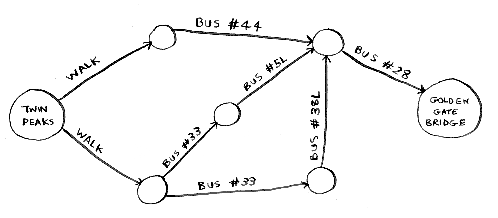
  - Qual algoritmo você propõe para encontrar o caminho com menor número de etapas?
  - *Podemos ver se com uma etapa chegamos à ponte, senão, vemos com duas etapas, senão, vemos com três, senão com quatro, e assim por diante até chegarmos à ponte com o menor número de etapas possível*
  - *No caso do grafo acima, o número mínimo de etapas para chegar à ponte é 3*
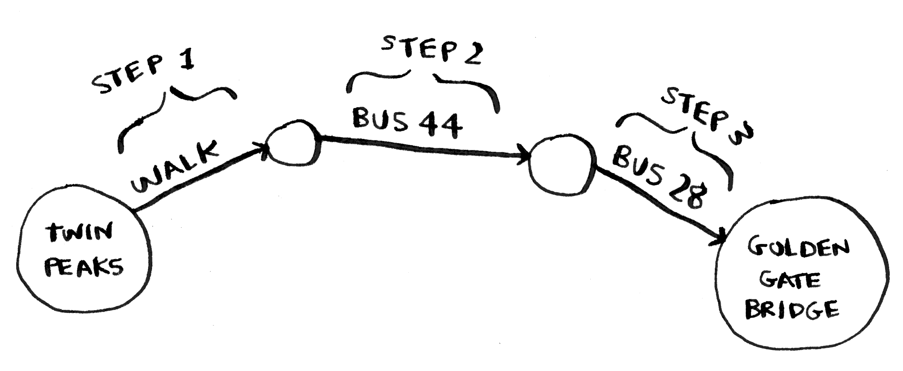
  - Existem outras rotas que levam até a ponte, mas elas são mais longas
  - O algoritmo descobriu o caminho mais curto até a ponte demanda três etapas
  - Esse tipo de problema é chamado de *problema do caminho mínimo*
  - Neste problema sempre se tenta achar o caminho mínimo para algo, como a rota mais curta entre dois pontos ou número mínimo de movimentos para dar xeque-mate em um jogo de xadrez
  - ***O algoritmo que resolve problemas de caminho mínimo é a pesquisa em largura***
  - Para descobrir como ir da Twin Peaks até a Golden Gate existem duas etapas:
    1. Modelar o problema utilizando grafos
    2. Resolver o problema utilizando a pesquisa em largura

- O que é um grafo?
  - Um modelo de grafo é um conjunto de conexões
  - ***Um grafo é uma estrutura de conjunto de pontos (vértices) e de conjunto de ligações entre os pontos (arestas)***
  - Por exemplo, se quer descrever quem deve dinheiro a quem num jogo de pôquer
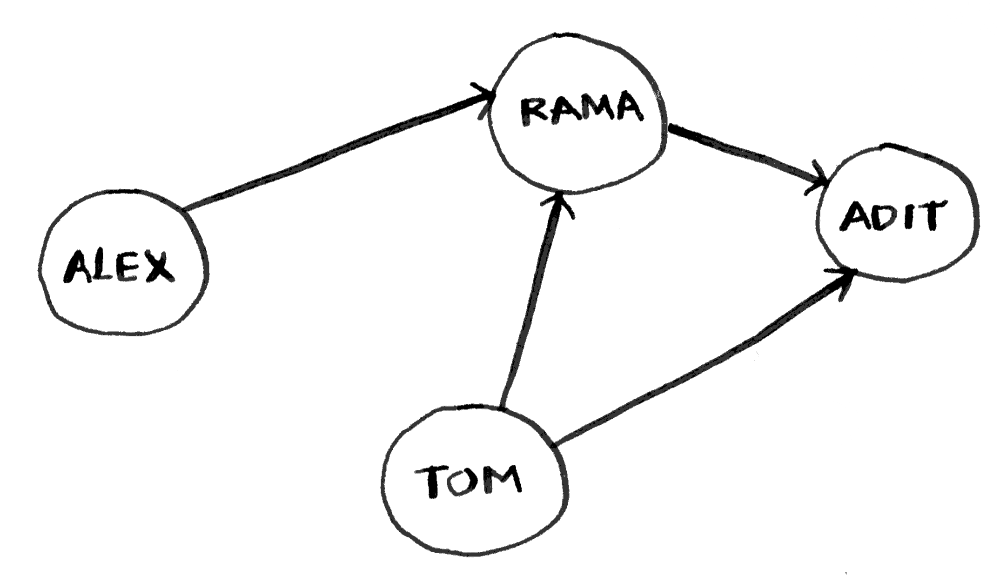
  - O grafo acima descreve pessoas que devem dinheiro a outras pessoas em uma partida de pôquer
  - Cada grafo é constituido de vértices e arestas
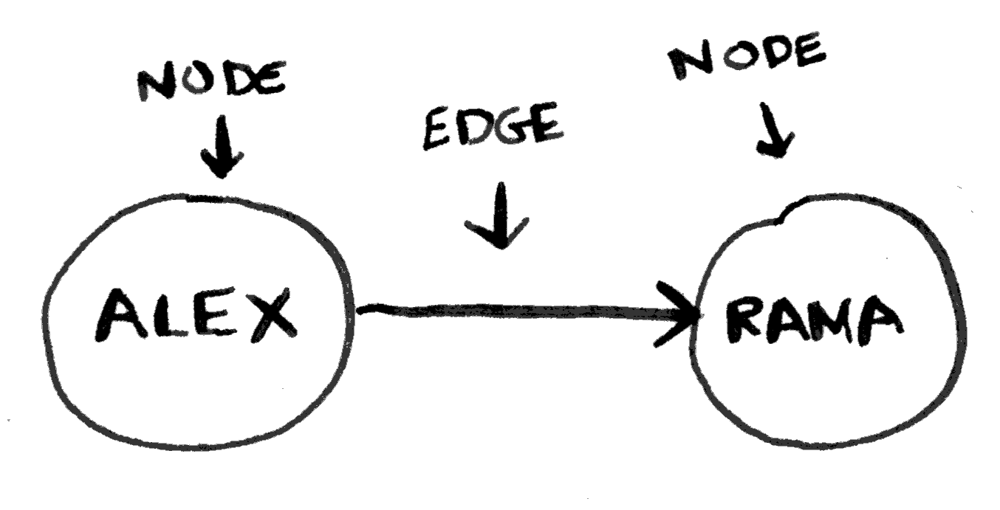
  - Grafos são formados por vértices e arestas, e um vértice pode ser diretamente conectado a muitos outros vértices, por isso os chamamos de vizinhos
  - No grafo da partida de pôquer, Rama é vizinha de Alex. Já Adit não é vizinho de Alex, pois eles não estão diretamente conectados, mas Adit é vizinho de Rama e de Tom
  - **Vértices vizinhos são vértices que estão diretamente conectados**
  - Os grafos são uma maneira de modelar como eventos diferentes estão conectados entre si

- Pesquisa em largura
  - A pesquisa em largura é um tipo diferente de algoritmo, pois utiliza grafo
  - Este algoritmo ajuda a responder dois tipos de perguntas:
    1. Existe algum caminho do vértice A até o vértice B?
    2. Qual o caminho mínimo do vértice A até o vértice B?
  - Vamos supor que você seja dono de uma fazenda de mangas e está a procura de um vendedor para vender suas mangas
  - Você conhece algum vendedor de mangas no Facebook?
  - Existe algum vendedor de mangas na minha rede? (Pergunta 1)
  - Você pode começar a procurar entre seus amigos
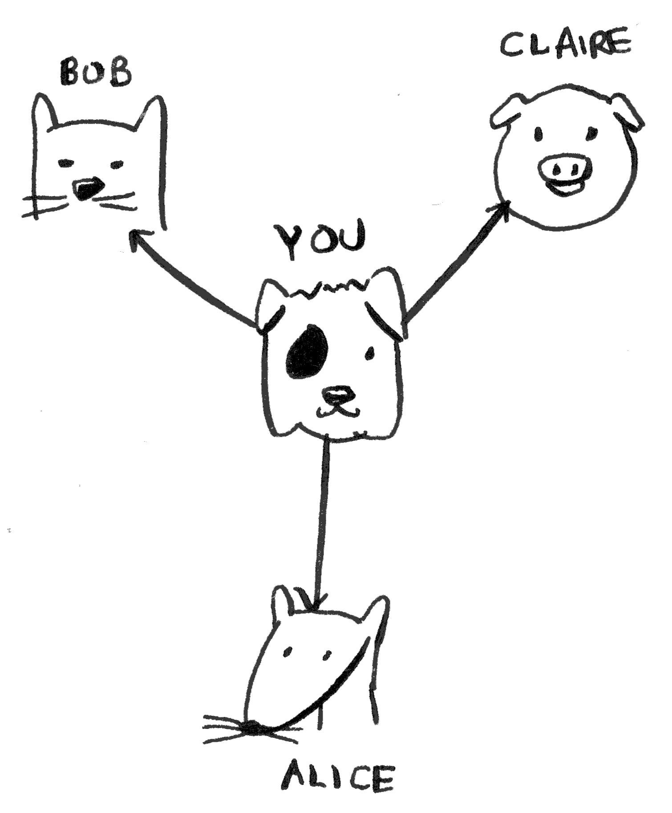
  - Primeiro, faça uma lista de amigos para pesquisar
  - Depois, vá até cada pessoa da lista e verifique se esta pessoa vende mangas
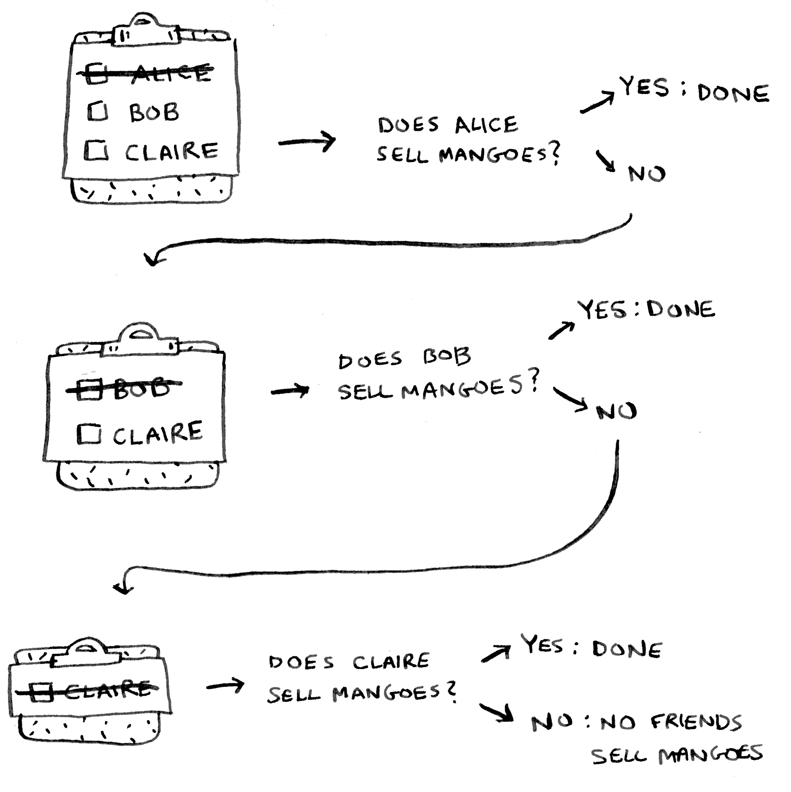
  - Imagine que nenhum de seus amigos vende mangas. Então, será necessário pesquisar entre os amigos de seus amigos
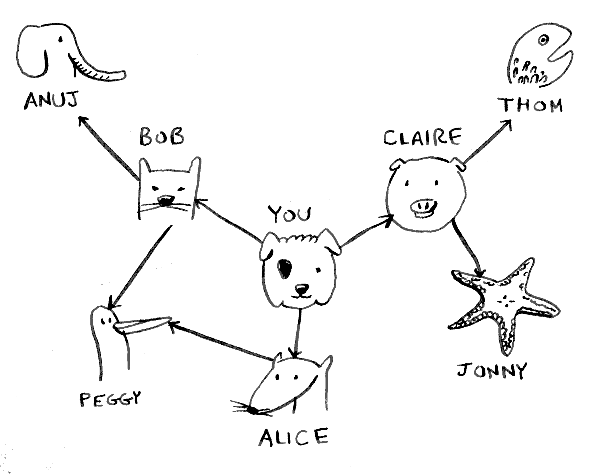
  - Cada vez que você pesquisar uma pessoa da lista, todos os amigos dela serão adicionados à lista
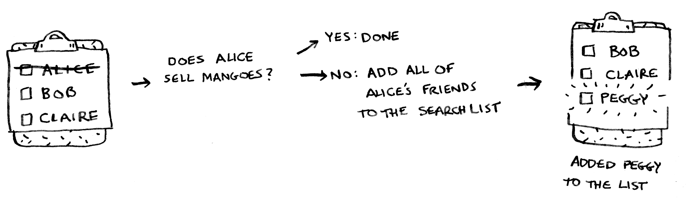
  - Dessa maneira você não pesquisa apenas entre seus amigos, mas também entre os amigos deles
  - Então, se Alice não é vendedora de mangas, você adicionará também os amigos dela à lista
  - Isso significa que, eventualmente, pesquisará entre os amigos dela e entre os amigos dos amigos, e assim por diante
  - Com esse algoritmo pesquisará toda a sua rede até que encontre um vendedor de mangas
  - Isto é o algoritmo de pesquisa em largura em ação

- Encontrando o caminho mínimo
  - Relembrando, existem dois tipos de pergunta que a pesquisa em largura responde:
    1. Existe um caminho do vértice A ao vértice B? (Existe um vendedor de manga na minha rede?)
    2. Qual o caminho mínimo do vértice A ao vértice B? (Quem é o vendedor de manga mais próximo?)
  - A pergunta 1 foi respondida no item anterior
  - Agora, você consegue encontrar o vendedor de mangas mais próximo? (Pergunta 2)
  - Seus amigos são conexões de primeiro grau e os amigos deles são conexões de segundo grau
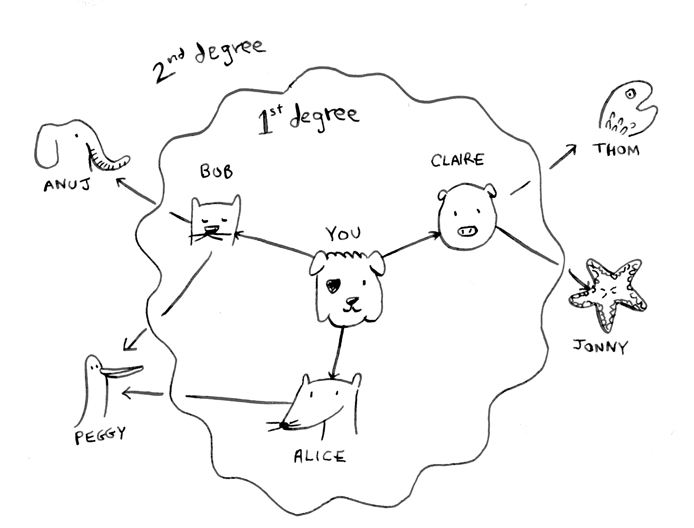
  - Você preferiria uma conexão de primeiro grau em vez de uma de segundo grau, e uma conexão de segundo grau a uma de terceiro grau, e assim por diante
  - Portano, **não se deve pesquisar nenhuma conexão de segundo grau antes de você ter certeza de que não existe uma conexão de primeiro grau com vendedor de mangas**
  - A pesquisa em largura já faz isso
  - *O funcionamento da pesquisa em largura faz com que a pesquisa irradie a partir do ponto inicial*
  - **Você verificará as conexões de primeiro grau antes das conexões de segundo grau**
  - ***Conexões de primeiro grau são adicionadas à pesquisa antes de conexões de segundo grau***
  - Você apenas segue a lista e verifica se a pessoa é uma vendedora de mangas
  - ***As conexões de primeiro grau serão procuradas antes das de segundo grau, e, dessa forma, você encontrará o vendedor de mangas mais próximo***
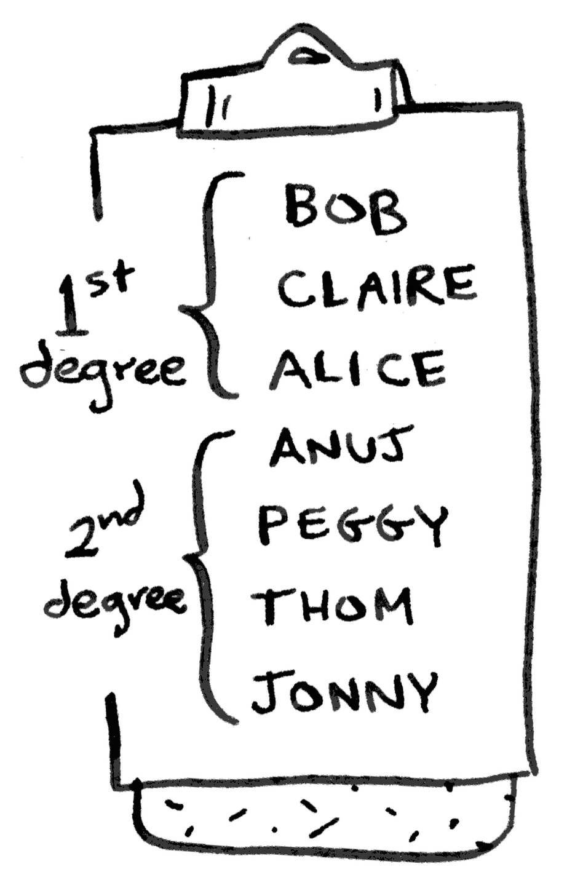
  - **Isso só funciona se você procurar as pessoas na mesma ordem em que elas foram adicionadas**
  - O que acontece se você pesquisar por Anuj antes de Claire, sendo que ambos são vendedores de mangas?
  - Anuj é um contato de segundo grau enquanto Claire é um contato de primeiro grau, o que fará com que o vendedor de mangas encontrado não seja o mais próximo
  - Portanto, é necessário pesquisar as pessoas na ordem em que elas foram adicionadas; para isso existe uma estrutura de dados específica: a fila

- Filas
  - *Uma fila em estrutura de dados funciona exatamente como uma fila da vida real*
  - Elas possuem um funcionamento similar ao das pilhas
  - Não é possível acessar elementos aleatórios numa fila
  - ***Existem apenas duas operações possíveis em filas***:
    - ***Enqueue (enfileirar)***
    - ***Dequeue (desenfileirar)***
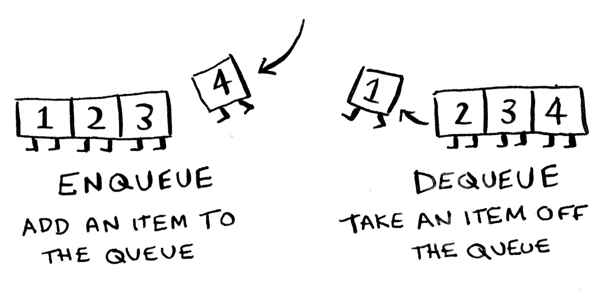
  - Se você enfileirar dois itens na fila, o primeiro item adicionado será desenfileirado antes do segundo item
  - ***A fila é uma estrutura de dados FIFO (First In First Out)***
  - **Já a pilha é uma estrutura de dados LIFO (Last In First Out)**
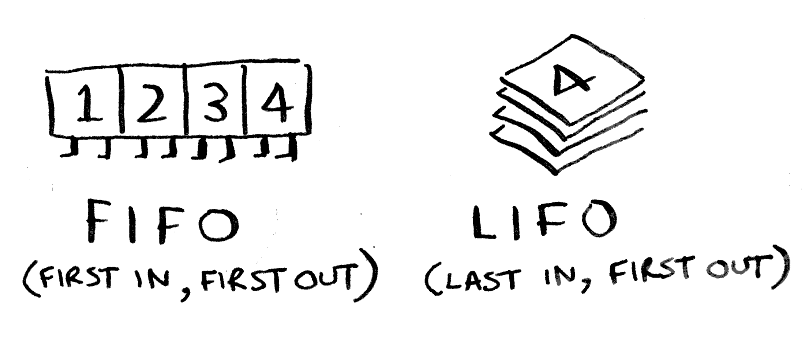

- Implementando o grafo
  - Um grafo consiste em diversos vértices
  - Cada vértice está conectado aos vértices vizinhos
  - Tabela hash é uma estrutura de dados que permite expressar relações
  - Se deseja mapear um vértice a todos os seus vizinhos

    ```python
    graph = {}
    graph["you"] = ["alice", "bob", "claire"]
    ```

  - Um grafo é apenas um monte de vértices e arestas, portanto o código acima é tudo que você precisa para ter um grafo em Python


  - O grafo da imagem, em Python, ficaria assim:

    ```python
    graph = {}
    graph["you"] = ["alice", "bob", "claire"]
    graph["bob"] = ["anuj", "peggy"]
    graph["alice"] = ["peggy"]
    graph["claire"] = ["thom", "jonny"]
    graph["anuj"] = []
    graph["peggy"] = []
    graph["thom"] = []
    graph["jonny"] = []
    ```

    - Anuj, Peggy, Thom e Jonny não têm vizinhos
    - Eles têm setas apontadas para eles, mas nenhuma seta partindo deles para outros
    - Isso se chama dígrafo (ou grafo direcionado), onde a relação acontece apenas em um sentido
    - Logo, Anuj é visinho de Bob, mas Bob não é vizinho de Anuj
    - Um grafo não direcionado não contém setas e ambos os vértices são vizinhos um do outro

- Implementando o algoritmo
  - Este algoritmo utiliza um grafo como estrutura de dados
  - Então é necessário modelar o problema utilizando grafos
  - Lógica da pesquisa em largura (para achar um vendedor de mangas mais próximo):
    1. Crie uma fila contendo todas as pessoas que devem ser verificadas
    2. Retire uma pessoa da fila
    3. Confira se esta pessoa é um vendedor de mangas
    4. Se sim, pronto, você encontrou o vendedor de mangas mais próximo, return True
    5. Senão, adicione todos vizinhos dela na fila
    6. Repita
    7. Caso a fila esteja vazia, não existe vendedores de manga em sua rede, return False
  - Ao verificar uma pessoa, deve-se marcá-la como verificada para que ela não seja pesquisada novamente
  - [Algoritmo da pesquisa em largura](algorithms/bfs/breadth_first_search.py)

    ```python
    def breadth_first_search(name):
        '''Search for a mango seller in a graph'''
        queue = deque()
        queue.extend(graph["you"])
        verified_names = []

        while queue:
            name = queue.popleft() # gets the first person in the queue

            if name not in verified_names:
                if is_person_seller(name): # check if the person is a seller
                    print(f"{name} is a mango seller!")
                    return True # yes, they're a seller

                # no, they ain't a seller, add all their friends to the queue
                queue.extend(graph[name])
                verified_names.append(name)

    return False
    ```

- Tempo de execução
  - Se você procurar um vendedor de mangas em toda a sua rede, cada aresta será analisada
  - Portanto o tempo de execução é, no mínimo, O(número de arestas)
  - Além disso, será mantida uma lista com pessoas já verificadas
  - Adicionar pessoas à lista leva um tempo constante O(1)
  - Fazer isso para cada pessoa terá tempo de execução O(número de pessoas) no total
  - Assim, a pesquisa em largura tem tempo de execução O(número de pessoas + número de arestas)
  - A = número de arestas
  - V = número de vértices
  - ***A pesquisa em largura tem tempo de execução O(A + V)***

- ***Principais pontos***
  - **A pesquisa em largura serve para achar o camiho mínimo do ponto A até o ponto B em um grafo direcionado (dígrafo)**
  - A pesquisa em largura lhe diz se há um caminho de A para B
  - Se esse caminho existe, a pesquis em largura lhe dará o caminho mínimo
  - Se você tem um problema do tipo "encontre o menor X", tente modelar o seu problema utilizando grafos e use a pesquisa em largura para resolvê-lo
  - Um dígrafo contém setas e as relações seguem a direção das setas
  - Grafos não direcionados não contém setas, e as relações acontecem nos dois sentidos
  - Filas são FIFO (First In First Out)
  - Pilhas são LIFO (Last In First Out)
  - Você precisa verificar os itens na ordem em que foram adicionados à fila de pesquisa. Portanto, a lista de pesquisa deve ser uma fila; caso contrário, você não obterá o caminho mínimo
  - Cada vez que você precisar verificar alguém, procure não verificá-lo novamente. Caso contrário, poderá acabar em um loop infinito
